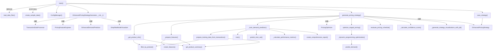

```mermaid
graph TB
    main["main()"]
    load_data["load_data_files()"]
    create_sample["create_sample_data()"]
    config_mgr["ConfigManager()"]
    generator_init["EnhancedPricingStrategyGenerator.__init__()"]
    data_proc["TransactionDataProcessor"]
    feature_eng["PricingFeatureEngineer"]
    demand_pred["EnhancedDemandPredictor"]
    visualizer["SimplifiedModelVisualizer"]
    generate_strategy["generate_pricing_strategy()"]
    get_product_info["_get_product_info()"]
    filter_product["filter_by_product()"]
    get_summary["get_product_summary()"]
    prepare_features["_prepare_features()"]
    create_features["create_features()"]
    train_predictor["_train_demand_predictor()"]
    prepare_training["prepare_training_data_from_transactions()"]
    train_model["train()"]
    predict_train["predict_train_set()"]
    calc_metrics["_calculate_performance_metrics()"]
    create_report["create_comprehensive_report()"]
    optimizer["PricingOptimizer"]
    optimize_pricing["optimize_staged_pricing()"]
    dp_optimization["_dynamic_programming_optimization()"]
    predict_demand["predict_demand()"]
    evaluate_schedule["evaluate_pricing_schedule()"]
    calc_confidence["_calculate_confidence_score()"]
    generate_viz["_generate_strategy_visualizations_with_pil()"]
    strategy_obj["EnhancedPricingStrategy"]
    save_strategy["save_strategy()"]
    main -->|文件存在| load_data
    main -->|文件不存在| create_sample
    main --> config_mgr
    main --> generator_init
    generator_init -->|创建| data_proc
    generator_init -->|创建| feature_eng
    generator_init -->|创建| demand_pred
    generator_init -->|创建| visualizer
    main --> generate_strategy
    generate_strategy --> get_product_info
    get_product_info --> filter_product
    get_product_info --> get_summary
    generate_strategy --> prepare_features
    prepare_features --> create_features
    prepare_features --> get_summary
    generate_strategy --> train_predictor
    train_predictor --> prepare_training
    train_predictor --> train_model
    train_predictor --> predict_train
    train_predictor --> calc_metrics
    train_predictor --> create_report
    prepare_training --> filter_product
    prepare_training --> get_summary
    generate_strategy -->|创建| optimizer
    generate_strategy --> optimize_pricing
    optimize_pricing --> dp_optimization
    dp_optimization --> predict_demand
    generate_strategy --> evaluate_schedule
    generate_strategy --> calc_confidence
    generate_strategy --> generate_viz
    generate_strategy -->|创建| strategy_obj
    main --> save_strategy
    save_strategy --> strategy_obj
```
